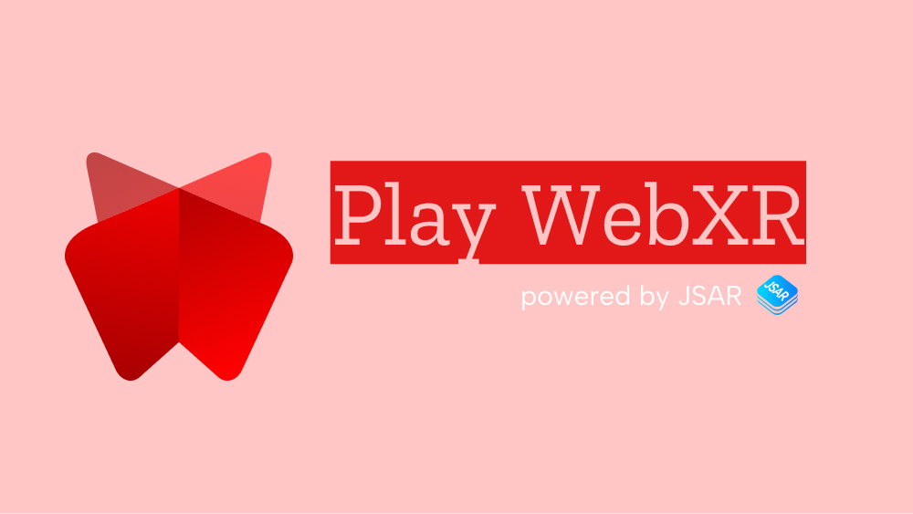
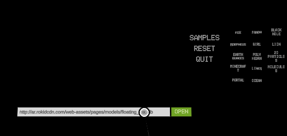
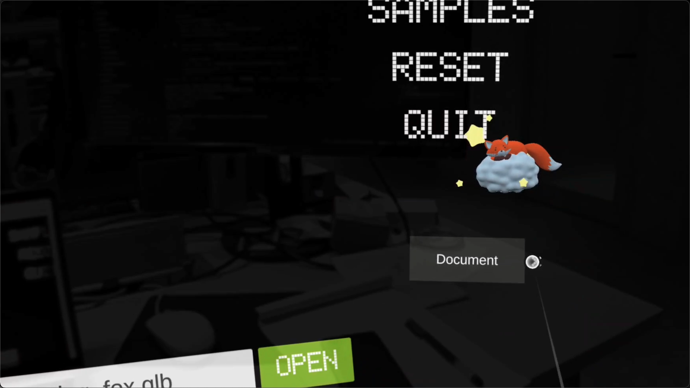
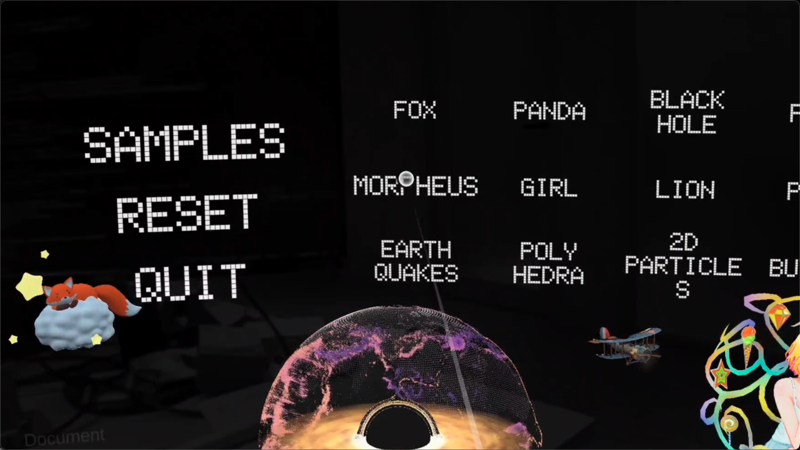
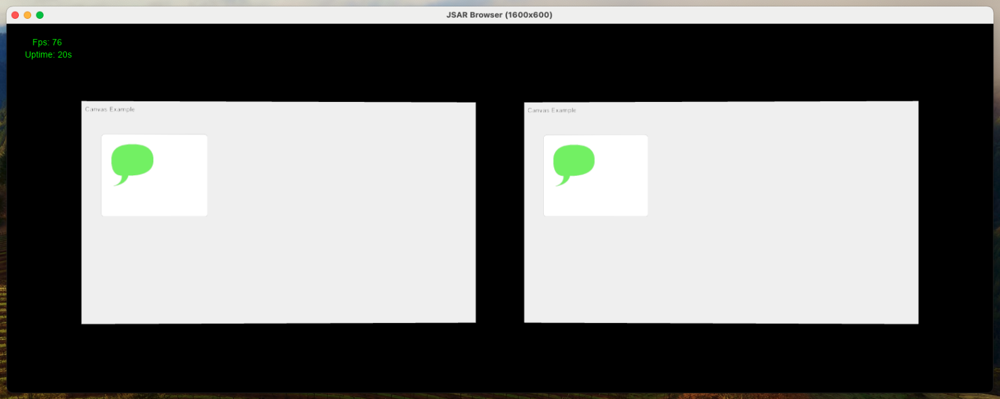

# Run Web Contents in JSAR

In the previous sections, you've learned how to install _Play WebXR_ and how to create a HTML file for JSAR. Next, let's see how to run it in _Play WebXR_ app and other ways.

JSAR is a browser engine library only, it doesn't provide the specific ways to run, but we did build tools to help developers run your project.

- [classic Web browser](#classic-web-browser)
- [_Play WebXR_ app](#play-webxr-app)
  - Rokid AR Studio
  - Rokid AR Lite
- [macOS simulator](#macos-simulator)
- HyperWeb browser (Coming Soon)

## Classic Web Browser

In a classic Web browser, developers can run HTML files directly.

### Run HTML in classic Web browser

HTML is of course supported in any classic Web browser, you only need to make your HTML can be run both in classic Web browser and JSAR-integrated browsers. The following is the example of how to run your project in a classic Web browser:

```html title="index.html"
<html lang="en">
<head>
  <meta charset="UTF-8">
  <meta name="viewport" content="width=device-width, initial-scale=1.0">
  <title>My First WebXR</title>
  <script type="module">
    import * as THREE from 'three';

    let renderer;
    const gl = navigator.gl;
    if (typeof gl !== 'undefined') {
      /** If the navigator.gl exists, it's the JSAR environment */
      renderer = new THREE.WebGLRenderer({
        canvas: {
          addEventListener() { },
        },
        context: gl,
      });
      // ...
    } else {
      /** If the navigator.gl doesn't exist, it's the classic Web browser */
      renderer = new THREE.WebGLRenderer(); // This creates a default canvas element.
    }

    // Do the rest of your 3D rendering here.
  </script>
</head>
<body>
</body>
</html>
```

As the above code shows, you can use the `navigator.gl` to detect whether the current environment is JSAR. If it exists, it's the JSAR environment, and you can create a `three` renderer with the **shared WebGL context**. Otherwise, it's the classic Web browser, and you can create a `three` renderer with the default canvas element.

> **Shared WebGL context** is a spatial Web concept introduced by JSAR, it allows Web applications to render 3D contents such as GLTF models, builtin 3D geometries and more in the shared scene space with the host environment and other Web applications. This is the key feature of JSAR that enables the progressive experience to use Web contents for users.

To use this way, you can easily run your HTML project in any classic Web browser for application development, testing and debugging, and then run it in JSAR to use, is it fun, right?

## _Play WebXR_ app

_Play WebXR_ is an application that integrates JSAR to run Web contents, images, and 3D models. It currently supports Rokid AR devices like Rokid AR Studio and Rokid AR Lite.



> Want to install _Play WebXR_? please refer to [Setup](./setup.mdx#install-_play-webxr_).

Running HTML and other supported formats in _Play WebXR_ is easy, just type the URL of your project in the input box and click the "OPEN" button.



Then you can see your application is opened there:



When you opened it, you can drag, move and remove it as you like in the space. Of course you are able to open another one at the same time.



## macOS Simulator

The JSAR simulator is a macOS application that could open URLs via commands:

```sh
$ ./jsar_desktop_opengl -xr -w800 /path/to/jsar-runtime/fixtures/html/canvas.html
```



We use this simulator application to develop and test JSAR on macOS, and it could be a quick way to open HTML files for developers who doesn't have a Rokid AR device.
